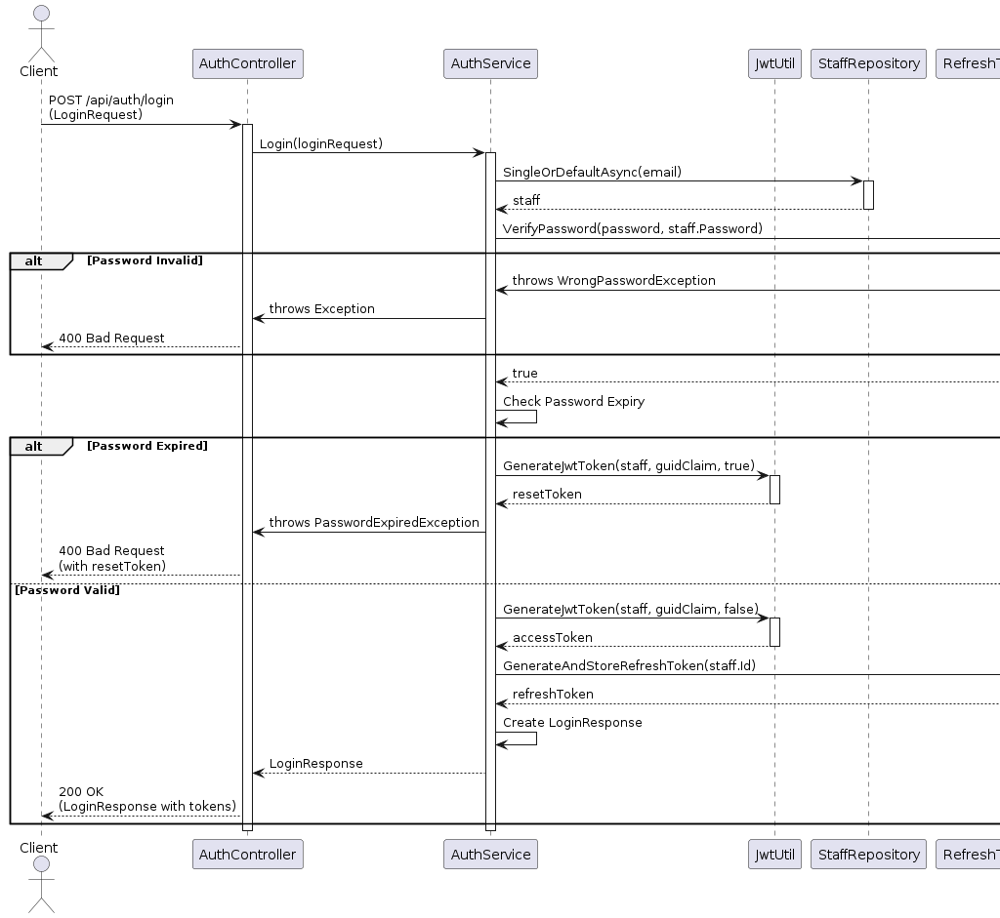
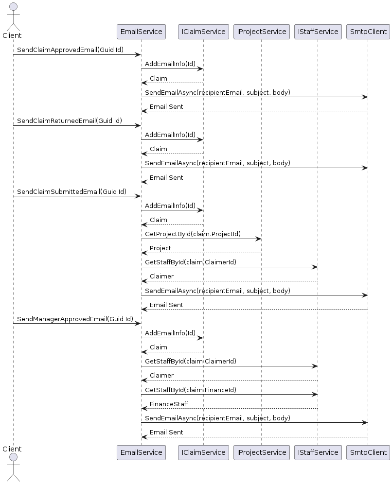
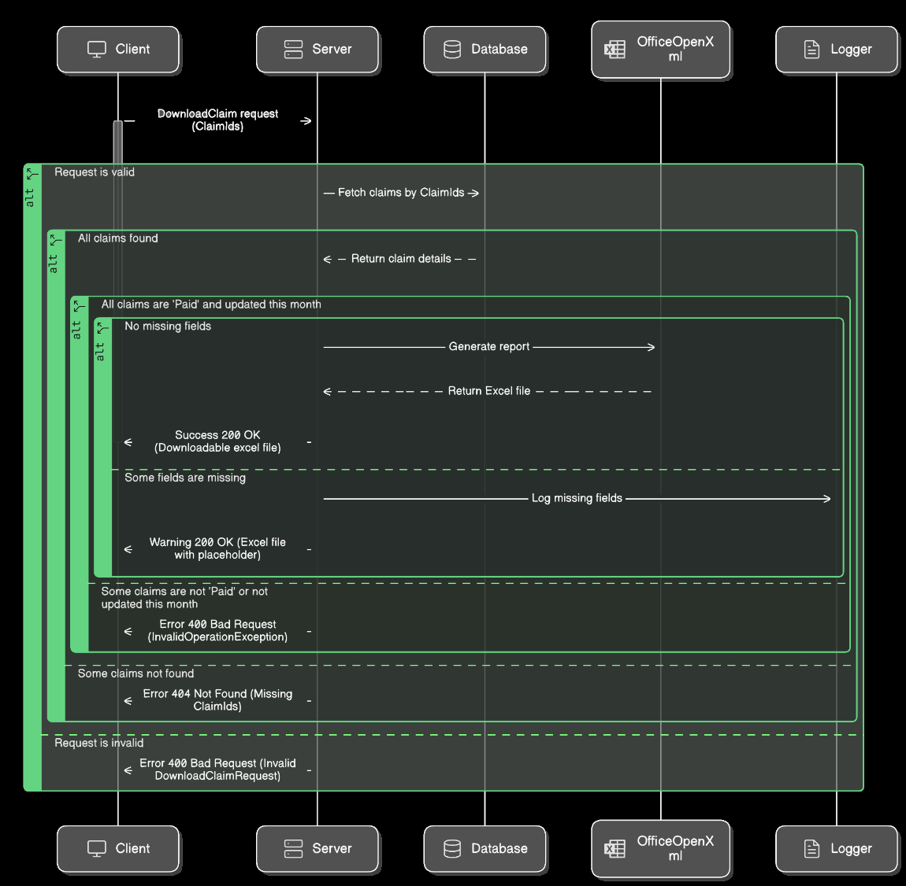

<div align="center">

# Claim Request System

A centralized system that supports the creation of claims and reduces paperwork for FPT Software staff.


## Quick Links
**[API Documentation](https://claim-request-system.azurewebsites.net/swagger/index.html)** • 
**[Live Demo](https://crs24.vercel.app/)** • 
**[Documentation](Document/Demo/FinalDemoNET04.pptx)**

</div>

## Table of Contents
- [Quick Links](#quick-links)
- [Getting Started](#getting-started)
  - [Prerequisites](#prerequisites)
  - [Database Setup](#database-setup)
  - [Building the Solution](#building-the-solution)
- [Architecture](#architecture)
  - [Data Access Layer Architecture](#data-access-layer-architecture)
  - [Design Patterns](#design-patterns)
    - [Unit of Work Pattern](#unitofwork-pattern-overview)
    - [Dependency Injection Pattern](#dependency-injection-pattern)
    - [Singleton Pattern](#singleton-pattern)
    - [Builder Pattern](#builder-pattern)
    - [Middleware Pattern](#middleware-pattern)
    - [Strategy Pattern](#strategy-pattern)
- [Features](#features)
  - [Authentication](#authentication)
  - [Email Services](#email-services)
  - [Integration Services](#integration-services)
  - [Claim Management](#claim-management)
  - [Staff Management](#staff-management)
- [Testing](#testing)
  - [Unit Test Results](#unit-test-results)

## Getting Started

### Prerequisites
- .NET 8.0 SDK
- PostgreSQL
- Docker (optional)

### Database Setup

1. Install Entity Framework tools
```bash
dotnet tool install --global dotnet-ef
```

2. Create new migration
```bash
dotnet ef migrations add InitialCreate --project ClaimRequest.Data
```

3. Apply migrations
```bash
dotnet ef database update --project ClaimRequest.Data
```

### Building the Solution

1. Clone the repository
```bash
git clone https://github.com/your-repo/claim-request-system.git
```

2. Build using .NET CLI
```bash
dotnet build
```

3. Using Docker
```bash
docker-compose build
docker-compose up
```

## Architecture


### Data Access Layer Architecture

#### UnitOfWork Pattern Overview


#### Architecture Layers
- **Client Layer**: Application code using the UnitOfWork
- **Business Layer**: UnitOfWork and Repository implementations
- **Data Layer**: Entity Framework DbContext and Database

#### Core Components
- **UnitOfWork<TContext>**: Manages transaction lifecycle and repository creation
- **GenericRepository<T>**: Type-safe data access operations
- **DbContext**: Entity Framework database context
- **Database**: Underlying PostgreSQL database

#### Transaction Management

##### Automatic Transaction Handling
```csharp
public class ClaimService
{
    private readonly IUnitOfWork _unitOfWork;

    public async Task<bool> ProcessClaim(Claim claim)
    {
        return await _unitOfWork.ProcessInTransactionAsync(async () =>
        {
            var claimRepo = _unitOfWork.GetRepository<Claim>();
            await claimRepo.AddAsync(claim);
            return true;
        });
    }
}
```

##### Manual Transaction Control
- Begin transaction: `BeginTransactionAsync()`
- Commit changes: `CommitAsync()`
- Rollback changes: `RollbackAsync()`

#### Key Features
- Lazy repository initialization
- Automatic transaction management
- Change tracking and validation
- Exception handling with rollback
- Repository pattern implementation


### Dependency Injection Pattern


#### Implementation Details
- Services are registered with scoped lifetime
- Constructor injection used in BaseService for:
  - IUnitOfWork
  - ILogger
  - IMapper
  - IHttpContextAccessor
- Benefits:
  - Loose coupling between components
  - Easy to swap implementations
  - Better testability through mocking


### Singleton Pattern


#### Implementation Details
- Utility services registered as singletons:
  - JwtUtil for token management
  - OtpUtil for OTP operations
- Characteristics:
  - Single instance shared across application
  - Thread-safe access to shared resources
  - Used for stateless utility services


### Builder Pattern


#### Implementation Details
- Used for fluent database context configuration
- Step-by-step construction of DbContext:
  1. Configure database provider
  2. Set retry policies
  3. Configure options
  4. Build final context
- Benefits:
  - Clear separation of construction steps
  - Fluent interface for configuration
  - Complex object creation made simple

```csharp
// src/ClaimRequest.API/Program.cs
void ConfigureDatabase()
{
    builder.Services.AddDbContext<ClaimRequestDbContext>(options =>
    {
        options.UseNpgsql(builder.Configuration.GetConnectionString("SupaBaseConnection"),
            npgsqlOptionsAction: sqlOptions =>
            {
                sqlOptions.EnableRetryOnFailure(
                    maxRetryCount: 5,
                    maxRetryDelay: TimeSpan.FromSeconds(30),
                    errorCodesToAdd: null);
            });
    });
}
```

```csharp
// src/ClaimRequest.Data/Data/ClaimRequestDbContext.cs
public class ClaimRequestDbContext : DbContext
{
    protected override void OnModelCreating(ModelBuilder modelBuilder)
    {
        // Schema configuration
        modelBuilder.HasDefaultSchema("ClaimRequest");

        // Enum configurations
        modelBuilder.Entity<Staff>()
            .Property(s => s.SystemRole)
            .HasConversion<string>();

        // Relationship configurations
        modelBuilder.Entity<Claim>()
            .HasOne(c => c.Claimer)
            .WithMany()
            .HasForeignKey(c => c.ClaimerId);

        // Precision configurations
        modelBuilder.Entity<Claim>()
            .Property(c => c.Amount)
            .HasColumnType("decimal(18,2)");

        // Date configurations
        modelBuilder.Entity<Claim>()
            .Property(c => c.StartDate)
            .HasColumnType("date");
    }
}
```


### Middleware Pattern


#### Implementation Details
- Pipeline components in order:
  1. Exception Handling
  2. Reset Password
  3. Authentication
  4. CORS
- Features:
  - Sequential request processing
  - Each middleware can modify request/response
  - Chain of responsibility pattern
  - Centralized cross-cutting concerns


### Strategy Pattern


#### Implementation Details
- Query strategies implemented through delegates
- Components:
  - Predicates for filtering data
  - OrderBy for sorting results
  - Include for eager loading relations
- Benefits:
  - Flexible query composition
  - Runtime strategy selection
  - Encapsulated query logic
  - Reusable query components


```csharp
// src/ClaimRequest.Data/Repositories/Implements/GenericRepository.cs
public class GenericRepository<T> : IGenericRepository<T> where T : class
{
    protected readonly DbSet<T> _dbSet;

    public virtual async Task<T> SingleOrDefaultAsync(
        Expression<Func<T, bool>> predicate = null,
        Func<IQueryable<T>, IOrderedQueryable<T>> orderBy = null,
        Func<IQueryable<T>, IIncludableQueryable<T, object>> include = null)
    {
        IQueryable<T> query = _dbSet;

        if (include != null)
            query = include(query);

        if (predicate != null)
            query = query.Where(predicate);

        if (orderBy != null)
            return await orderBy(query).AsNoTracking().FirstOrDefaultAsync();

        return await query.AsNoTracking().FirstOrDefaultAsync();
    }
}
```

```csharp
// src/ClaimRequest.Service/Services/Implements/ProjectService.cs
var project = await _unitOfWork.GetRepository<Project>()
    .SingleOrDefaultAsync(
        predicate: p => p.Id == id && p.IsActive,
        include: q => q
            .Include(p => p.ProjectManager)
            .Include(p => p.FinanceStaff)
            .Include(p => p.ProjectStaffs)
                .ThenInclude(ps => ps.Staff)
    );
```


## Features

<h3 align="center">Authentication</h3>

<h4 align="center">Login with Google OAuth2</h4>

<div align="center">



</div>

<h4 align="center">Password Management</h4>

<div align="center">

##### Change Password


##### Forgot Password with OTP


##### Refresh Token Service


</div>

<h3 align="center">Email Services</h3>

<div align="center">

#### Email Notifications


#### OTP Email Confirmation


</div>

<h3 align="center">Integration Services</h3>

<div align="center">

#### Cloud Storage Integration


#### Payment Gateway Integration

</div>

<h3 align="center">Claim Management</h3>

<div align="center">

#### Create and Process Claims

##### Create New Claims


##### Update Claims


##### Return Claims


##### Submit Claims


#### Claim Review Process

##### Approve Claims


##### Reject Claims


#### Cancel Claims


#### Document Management


#### Payment Processing


#### Claim Listing and Details

##### View All Claims


#### Staff Assignment

##### Assign Staff to Claim


##### Remove Staff from Claim


</div>

<h3 align="center">Staff Management</h3>

<div align="center">

#### Staff Listing and Details

##### View All Staff


##### Staff Details


#### Staff Operations

##### Create Staff


##### Update Staff


##### Delete Staff


##### Pagination Support


</div>

## Testing

### Unit Test Results
Staff Service Tests


Email Service Tests


Claim Service Tests:

Paid Claim Tests


Reject Claim Tests


Submit Claim Tests


Get Claim Tests


Assign/Remove Staff Tests


To run tests:
```bash
dotnet test
```

Using Docker:
```bash
./scripts/run-tests.sh
```
