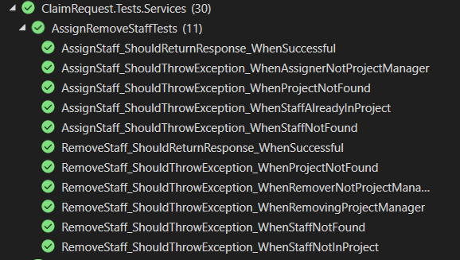

# Claim Request System

A centralized system that supports the creation of claims and reduces paperwork for FPT Software staff.

## Quick Links
- **API Documentation**: [Swagger UI](https://claim-request-system.azurewebsites.net/swagger/index.html)
- **Live Demo**: [Frontend Application](https://crs24.vercel.app/)
- **Documentation**: [Presentation Slides](Document/FinalDemoNET04.pptx)

## Table of Contents
- [Quick Links](#quick-links)
- [Getting Started](#getting-started)
- [Architecture](#architecture)
- [Features](#features)
- [Testing](#testing)

## Getting Started

### Prerequisites
- .NET 8.0 SDK
- PostgreSQL
- Docker (optional)

### Database Setup

1. Install Entity Framework tools
```bash
dotnet tool install --global dotnet-ef
```

2. Create new migration
```bash
dotnet ef migrations add InitialCreate --project ClaimRequest.Data
```

3. Apply migrations
```bash
dotnet ef database update --project ClaimRequest.Data
```

### Building the Solution

1. Clone the repository
```bash
git clone https://github.com/your-repo/claim-request-system.git
```

2. Build using .NET CLI
```bash
dotnet build
```

3. Using Docker
```bash
docker-compose build
docker-compose up
```

## Architecture


### Data Access Layer Architecture

#### UnitOfWork Pattern Overview


#### Architecture Layers
- **Client Layer**: Application code using the UnitOfWork
- **Business Layer**: UnitOfWork and Repository implementations
- **Data Layer**: Entity Framework DbContext and Database

#### Core Components
- **UnitOfWork<TContext>**: Manages transaction lifecycle and repository creation
- **GenericRepository<T>**: Type-safe data access operations
- **DbContext**: Entity Framework database context
- **Database**: Underlying PostgreSQL database

#### Transaction Management

##### Automatic Transaction Handling
```csharp
public class ClaimService
{
    private readonly IUnitOfWork _unitOfWork;

    public async Task<bool> ProcessClaim(Claim claim)
    {
        return await _unitOfWork.ProcessInTransactionAsync(async () =>
        {
            var claimRepo = _unitOfWork.GetRepository<Claim>();
            await claimRepo.AddAsync(claim);
            return true;
        });
    }
}
```

##### Manual Transaction Control
- Begin transaction: `BeginTransactionAsync()`
- Commit changes: `CommitAsync()`
- Rollback changes: `RollbackAsync()`

#### Key Features
- Lazy repository initialization
- Automatic transaction management
- Change tracking and validation
- Exception handling with rollback
- Repository pattern implementation

## Features

### Authentication
Login with Google OAuth2


Password Management:

Change Password


Forgot Password with OTP


OTP Email Confirmation


### Claim Management
Create New Claims


Return Claims


Cancel Claims


Download Claims


Paid Claims


Staff Assignment:

Assign Staff to Claim


Remove Staff from Claim


### Staff Management
View All Staff


Staff Details


Staff Operations:

Create Staff


Update Staff


Delete Staff


Pagination Support


## Testing

### Unit Test Results
Staff Service Tests


Email Service Tests


Claim Service Tests:

Paid Claim Tests


Reject Claim Tests


Assign/Remove Staff Tests



To run tests:
```bash
dotnet test
```

Using Docker:
```bash
./scripts/run-tests.sh
```