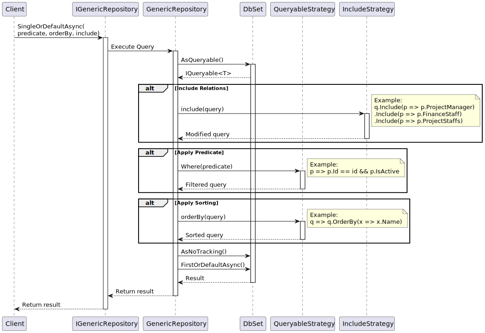
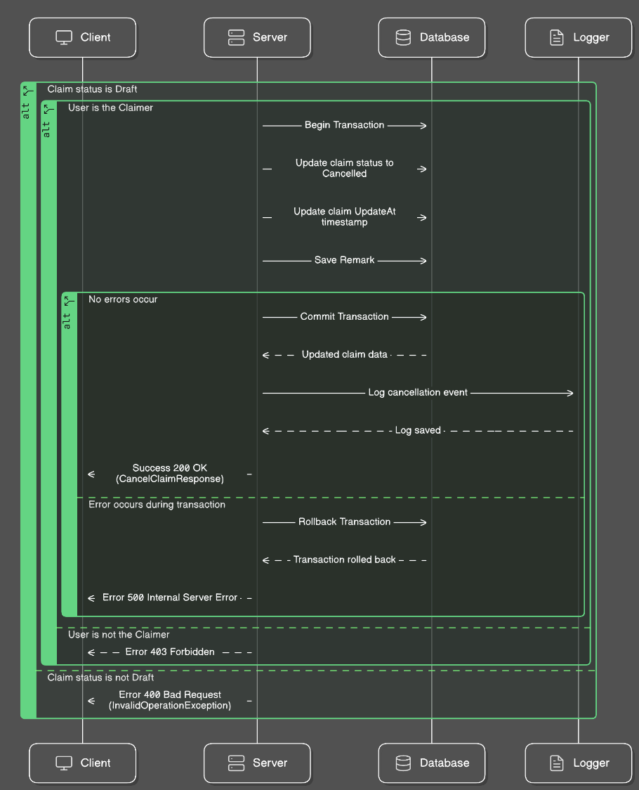

# Claim Request System

A centralized system that supports the creation of claims and reduces paperwork for FPT Software staff.

## Quick Links
- **API Documentation**: [Swagger UI](https://claim-request-system.azurewebsites.net/swagger/index.html)
- **Live Demo**: [Frontend Application](https://crs24.vercel.app/)
- **Documentation**: [Presentation Slides](Document/Demo/FinalDemoNET04.pptx)

## Table of Contents
- [Quick Links](#quick-links)
- [Getting Started](#getting-started)
  - [Prerequisites](#prerequisites)
  - [Database Setup](#database-setup)
  - [Building the Solution](#building-the-solution)
- [Architecture](#architecture)
  - [Data Access Layer Architecture](#data-access-layer-architecture)
  - [Design Patterns](#design-patterns)
    - [Unit of Work Pattern](#unitofwork-pattern-overview)
    - [Dependency Injection Pattern](#dependency-injection-pattern)
    - [Singleton Pattern](#singleton-pattern)
    - [Builder Pattern](#builder-pattern)
    - [Middleware Pattern](#middleware-pattern)
    - [Strategy Pattern](#strategy-pattern)
- [Features](#features)
  - [Authentication](#authentication)
  - [Claim Management](#claim-management)
  - [Staff Management](#staff-management)
- [Testing](#testing)
  - [Unit Test Results](#unit-test-results)

## Getting Started

### Prerequisites
- .NET 8.0 SDK
- PostgreSQL
- Docker (optional)

### Database Setup

1. Install Entity Framework tools
```bash
dotnet tool install --global dotnet-ef
```

2. Create new migration
```bash
dotnet ef migrations add InitialCreate --project ClaimRequest.Data
```

3. Apply migrations
```bash
dotnet ef database update --project ClaimRequest.Data
```

### Building the Solution

1. Clone the repository
```bash
git clone https://github.com/your-repo/claim-request-system.git
```

2. Build using .NET CLI
```bash
dotnet build
```

3. Using Docker
```bash
docker-compose build
docker-compose up
```

## Architecture


### Data Access Layer Architecture

#### UnitOfWork Pattern Overview


#### Architecture Layers
- **Client Layer**: Application code using the UnitOfWork
- **Business Layer**: UnitOfWork and Repository implementations
- **Data Layer**: Entity Framework DbContext and Database

#### Core Components
- **UnitOfWork<TContext>**: Manages transaction lifecycle and repository creation
- **GenericRepository<T>**: Type-safe data access operations
- **DbContext**: Entity Framework database context
- **Database**: Underlying PostgreSQL database

#### Transaction Management

##### Automatic Transaction Handling
```csharp
public class ClaimService
{
    private readonly IUnitOfWork _unitOfWork;

    public async Task<bool> ProcessClaim(Claim claim)
    {
        return await _unitOfWork.ProcessInTransactionAsync(async () =>
        {
            var claimRepo = _unitOfWork.GetRepository<Claim>();
            await claimRepo.AddAsync(claim);
            return true;
        });
    }
}
```

##### Manual Transaction Control
- Begin transaction: `BeginTransactionAsync()`
- Commit changes: `CommitAsync()`
- Rollback changes: `RollbackAsync()`

#### Key Features
- Lazy repository initialization
- Automatic transaction management
- Change tracking and validation
- Exception handling with rollback
- Repository pattern implementation


### Dependency Injection Pattern


#### Implementation Details
- Services are registered with scoped lifetime
- Constructor injection used in BaseService for:
  - IUnitOfWork
  - ILogger
  - IMapper
  - IHttpContextAccessor
- Benefits:
  - Loose coupling between components
  - Easy to swap implementations
  - Better testability through mocking


### Singleton Pattern


#### Implementation Details
- Utility services registered as singletons:
  - JwtUtil for token management
  - OtpUtil for OTP operations
- Characteristics:
  - Single instance shared across application
  - Thread-safe access to shared resources
  - Used for stateless utility services


### Builder Pattern

#### Implementation Details
- Used for fluent database context configuration
- Step-by-step construction of DbContext:
  1. Configure database provider
  2. Set retry policies
  3. Configure options
  4. Build final context
- Benefits:
  - Clear separation of construction steps
  - Fluent interface for configuration
  - Complex object creation made simple


### Middleware Pattern


#### Implementation Details
- Pipeline components in order:
  1. Exception Handling
  2. Reset Password
  3. Authentication
  4. CORS
- Features:
  - Sequential request processing
  - Each middleware can modify request/response
  - Chain of responsibility pattern
  - Centralized cross-cutting concerns


### Strategy Pattern


#### Implementation Details
- Query strategies implemented through delegates
- Components:
  - Predicates for filtering data
  - OrderBy for sorting results
  - Include for eager loading relations
- Benefits:
  - Flexible query composition
  - Runtime strategy selection
  - Encapsulated query logic
  - Reusable query components


## Features

### Authentication
Login with Google OAuth2


Password Management:

Change Password


Forgot Password with OTP


OTP Email Confirmation


### Claim Management
Create New Claims


Return Claims


Cancel Claims




Download Claims


Paid Claims


Staff Assignment:

Assign Staff to Claim


Remove Staff from Claim


### Staff Management
View All Staff


Staff Details


Staff Operations:

Create Staff


Update Staff


Delete Staff


Pagination Support


## Testing

### Unit Test Results
Staff Service Tests


Email Service Tests


Claim Service Tests:

Paid Claim Tests


Reject Claim Tests


Assign/Remove Staff Tests


To run tests:
```bash
dotnet test
```

Using Docker:
```bash
./scripts/run-tests.sh
```
